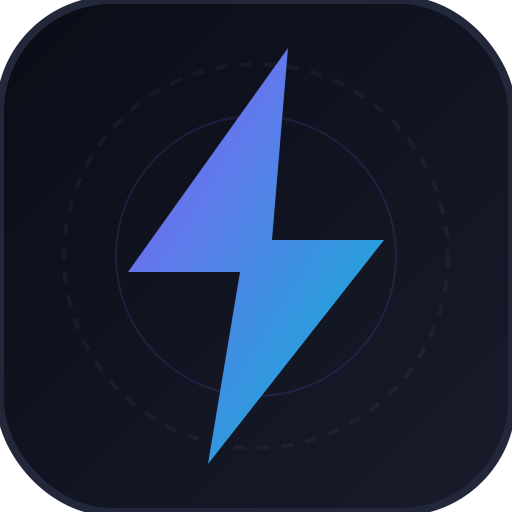

# ⚡ ZenStudy

> Real-time Personal Student Planner & Focus Companion (PWA)

ZenStudy is a premium, mobile-first, offline-capable student dashboard designed to help you track tasks, organize class schedules, time focus sessions, and monitor academic performance metrics—all local to your device, with no login or database authentication required.



---

## ✨ Features

### 📊 Personal Dashboard
* **Dynamic Greetings & Quotes:** Greets you by name and loads daily motivational prompts.
* **Academic Analytics:** Circular today-progress target indicator and a custom-drawn 7-day SVG completion bar chart.
* **Live Stats Counters:** Tracks your daily streak, focus study minutes, and completed tasks.
* **Deadlines Summary:** Quick view of the nearest major deadlines and exam countdowns.

### 📝 Tasks Manager
* **Priority Tints:** Visual crimson (high), amber (medium), and slate (low) glowing margins.
* **Subtask Checklist Builder:** Break down homework/assignments into granular checklist steps with inline progress bars.
* **Recurrence Engine:** Toggle tasks to reset daily or weekly.
* **Relative Due Dates:** Due dates convert into real-time student-friendly countdown text (e.g., "3h left", "1d 4h left", "Overdue").

### ⏳ Focus Timer (Pomodoro)
* **Customizable Durations:** Adjust your Focus and Break intervals in settings.
* **Web Audio Synthesis:** Zero external sound dependencies. Alarms are synthesized programmatically (Melodic Chime, Resonant Gong, Synthesizer Ring) and repeat continuously when the timer is up.
* **Custom Alarm Uploader:** Drag-and-drop your own audio tracks (up to 10MB) stored securely in your browser's local **IndexedDB** database.

### 📅 Interactive Timetable
* **Day-by-Day View:** Tap through Mon-Sun tabs to examine your weekly class agenda.
* **Live Class Scanner:** Automatically scans and flashes a glowing crimson indicator if a scheduled class is currently active.
* **Contextual Class Additions:** Pre-selects the currently viewed day when adding new schedules.

### ⚙️ Settings & Customization
* **Profile Settings:** Customize your profile name, role/goal (e.g., "Engineering Student"), and watch your initials avatar update instantly.
* **Notification Banners:** Connect Web Push notifications to trigger system alerts for countdown alarms and homework warnings.

---

## 🛠️ Tech Stack

* **Core Structure:** HTML5 (semantic layout)
* **Frontend Logic:** Vanilla JavaScript (ES modules)
* **Style System:** Vanilla CSS3 (custom variables, HSL color tokens, glassmorphism, responsive page animation transitions)
* **Database & Caching:** Web **LocalStorage** (for states and metrics) + **IndexedDB** (for media audio files)
* **Audio System:** Web Audio API (programmatic oscillator chime/gong synthesis)
* **PWA Engine:** Service Worker (`sw.js`) + Web App Manifest (`manifest.json`)

---

## 🚀 Getting Started

### 1. Prerequisites
Make sure you have [Node.js](https://nodejs.org/) installed.

### 2. Installation
Clone the repository and install developer dependencies:
```bash
npm install
```

### 3. Running Development Server
Start the local development server:
```bash
npm run dev
```
Open **[http://localhost:5173/](http://localhost:5173/)** in your browser.

### 4. Build for Production
Bundle and optimize static assets into the `dist/` directory:
```bash
npm run build
```

---

## 📱 Mobile Deployment Options

ZenStudy can be deployed to your mobile phone either as an installable Progressive Web App (PWA) or compiled as a fully standalone native application using Capacitor.

### Option A: Progressive Web App (Quick)
ZenStudy behaves exactly like a native app when added to your phone's Home Screen from your mobile browser:

1. Make the local server accessible to your network:
   ```bash
   npx vite --host
   ```
2. Open the printed **Network** URL (e.g. `http://192.168.0.20:5173/`) in your phone's browser (phone must be on the same Wi-Fi network).
3. Add to Home Screen:
   - **iOS Safari**: Tap the **Share** button -> scroll down -> tap **Add to Home Screen**.
   - **Android Chrome**: Tap the three-dot menu -> tap **Add to Home Screen** / **Install App**.

---

### Option B: Standalone Native Mobile App (Capacitor)
If you want a separate, packaged application (like an `.apk` installer file for Android or a compiled Xcode project for iOS):

#### 1. Compile and Sync Staged Code
Compile the Vite web bundle and synchronize the static assets to the native Android and iOS folders:
```bash
npm run cap:sync
```

#### 2. Build for Android (.apk)
* Install [Android Studio](https://developer.android.com/studio) on your computer.
* Open the Android platform folder inside Android Studio:
  ```bash
  npm run cap:open-android
  ```
* Connect your Android phone to your computer via USB (with **USB Debugging** enabled in Developer Settings).
* Click the **Run** button (green play icon) in the Android Studio toolbar to compile and install it directly to your phone.
* Alternatively, select **Build > Build Bundle(s) / APK(s) > Build APK(s)** to compile the standalone `.apk` installer.

#### 3. Build for iOS (Requires macOS)
* Install Xcode from the Mac App Store.
* Open the iOS project in Xcode:
  ```bash
  npx cap open ios
  ```
* Select your connected iPhone as the target device and click the **Run** button to compile and install.

